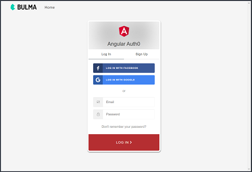

# Angular Auth0 App w/ Embedded Login Form
This project demonstrates the use of **Auth0's Lock v11** with an embedded login form using Angular and can easily be implemented for your own applications.  Auth0 has a nice [tutorial](https://auth0.com/docs/quickstart/spa/angular2/01-login) on how to integrate Angular with it's own hosted login page; however, there are some circumstances in which the embedded login form is much more convenient.  Full tutorials on how to implement this are lacking, but this [Auth0 GitHub repo](https://github.com/auth0-samples/auth0-angular-samples/tree/embedded-login/01-Embedded-Login) was helpful alongside the official [Auth0 Lock for Web](https://auth0.com/docs/libraries/lock/v11) documentation.

<p align="center">
    <br>
</p>

## Versions
* Angular v5.2.3
* [Bulma CSS Framework v0.62](https://bulma.io/)
* Auth0-js v9.2.0
* Auth0-lock v11.2.1

## Cloning the Project for Personal Use
### Installation
1. Clone this repo `git clone https://github.com/stanleyeosakul/angular-auth0.git`
1. `cd` into the folder of the cloned repo
1. Run `yarn install` to install dependencies
1. Configure your keys file `Shared/keys/keys.js`
    * From the root directory, create the keys file `touch Shared/keys/keys.ts`
    * Enter your `clientID` and `domain` from your client app settings in Auth0 into `keys.ts`

        ```typescript
          import { Auth0 } from '../models/Auth0';

          export const AUTH_CONFIG: Auth0 = {
            clientID: '<your-client-id-goes-here>',
            domain: '<your-client-domain-goes-here>',
            callbackURL: 'http://localhost:4200/loading'
          };
        ```

1. Run `ng serve`, and navigate to `http://localhost:4200/`
